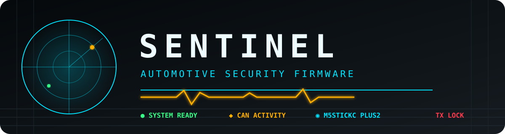

<p align="center">
  
</p>

<p align="center">
  
  
  
  
</p>

<p align="center">
  <strong>Firmware portable de sécurité embarquée et d’analyse automobile.</strong><br>
  Observer · Capturer · Analyser · Rejouer
</p>

---

## ◉ Vue d’ensemble

**SENTINEL** transforme le M5StickC Plus2 en instrument de terrain compact pour l’observation et l’analyse CAN. Le projet conserve la solide fondation ESP32 de [Bruce](https://github.com/BruceDevices/firmware), avec une identité visuelle, une navigation et une suite automobile indépendantes.

| <span style="color:#00e5ff">CYAN · ACTION</span> | <span style="color:#ffb000">AMBRE · ACTIVITÉ</span> | <span style="color:#39ff88">VERT · CONNECTÉ</span> | <span style="color:#ff3b4d">ROUGE · ALERTE</span> |
|:---:|:---:|:---:|:---:|
| Navigation et données | Trafic CAN et mesures | UART, CAN, SD et système | Erreurs et émission TX |

> [!CAUTION]
> Utilisez les fonctions radio, automobile et d’émission uniquement sur votre propre matériel ou avec une autorisation explicite. Le CAN TX démarre verrouillé et exige une confirmation physique.

> [!IMPORTANT]
> **Responsabilité de l’utilisateur —** SENTINEL est fourni à des fins de recherche, de diagnostic et d’apprentissage, sans garantie d’aucune sorte. Vous êtes seul responsable de son installation, de son branchement et de son utilisation. Les auteurs, contributeurs et projets cités ne pourront être tenus responsables d’un dommage matériel ou logiciel, d’une perte de données, d’une immobilisation, d’un accident ou de toute conséquence résultant d’une utilisation incorrecte, imprudente, illégale ou non autorisée. N’utilisez jamais les fonctions d’émission sur un véhicule en circulation ou sur un système critique. Respectez la législation locale et travaillez d’abord sur un banc isolé.

## ◆ Ce que le fork apporte

- boot **SENTINEL** et animation automobile, sans l’ancien visuel Bruce ;
- interface plein écran à quatre couleurs, conçue pour le petit écran du Stick ;
- navigation verticale avec une fonction par page ;
- suite CAN autonome : dashboard, IDs, capture ASC, replay et scénarios ;
- backends ESP32 TWAI et UART Lawicel/SLCAN ;
- diagnostic OBD-II via ELM327 Bluetooth Classic ;
- passerelle UART pour Proxmark3 RDV4 ;
- partage sécurisé du port Grove entre CAN et Proxmark ;
- WebUI CAN responsive avec validation côté firmware ;
- arrêt des opérations par double-clic haut et annulation des saisies par appui long.

## ⎍ Suite CAN

| Fonction | État | Détail |
|---|:---:|---|
| CAN 2.0 standard / étendu | 🟢 | IDs 11/29 bits, données et RTR, DLC 0–8 |
| Débits Lawicel | 🟢 | 10 kbit/s à 1 Mbit/s |
| Dashboard live | 🟢 | trames/s, activité, dernier ID, DLC et octets modifiés |
| Table d’activité | 🟢 | 128 IDs, fréquence, compteur et masque de changement |
| Captures ASC | 🟢 | horodatage et stockage dans `/Automotive/captures/` |
| Replay | 🟢 | ordre et temporisation d’origine, TX physiquement verrouillé |
| Scénarios JSON | 🟡 | stockage atomique dans `/Automotive/scenarios/` |
| ELM327 | 🟢 | régime, vitesse, température moteur et DTC |
| CAN-FD / ISO-TP / UDS / DBC | 🔴 | feuille de route |

Les filtres d’inclusion et d’exclusion sont conservés dans `/Automotive/filters.json`. Les IDs, DLC, données, délais et répétitions sont toujours validés par le firmware.

## ◎ WebUI CAN

La WebUI héritée de Bruce utilise désormais des sessions renforcées et expose un panneau CAN pour suivre le bus, gérer les scénarios et envoyer des trames autorisées.

```text
GET    /api/can/status       GET    /api/can/ids
GET    /api/can/config       POST   /api/can/config
POST   /api/can/lock         POST   /api/can/send
GET    /api/can/scenarios    POST   /api/can/scenario
DELETE /api/can/scenario
```

Les captures ASC se téléchargent avec le gestionnaire de fichiers existant.

## ⚡ Matériel et câblage

### Configuration principale

- **M5Stack M5StickC Plus2** ;
- transceiver CAN 3,3 V, idéalement isolé, pour ESP32 TWAI ;
- ou adaptateur UART Lawicel/SLCAN à 115200 bauds ;
- microSD pour les captures et scénarios ;
- ELM327 Bluetooth Classic, CANable ou Proxmark3 RDV4 en option.

### Liaison Grove SLCAN

| M5StickC Plus2 | Adaptateur | Signal |
|:---:|:---:|:---:|
| GPIO32 TX | RX | 🟦 Données vers l’adaptateur |
| GPIO33 RX | TX | 🟧 Données vers le Stick |
| GND | GND | ⬛ Masse commune |

> [!WARNING]
> CAN et Proxmark partagent le port Grove et ne doivent jamais fonctionner simultanément. Le +12 V de la broche 16 OBD-II ne doit jamais être relié au Stick.

Consultez le guide complet [Matériel CAN et OBD-II](docs/CAN_HARDWARE.md) avant tout branchement.

## ▶ Compiler et flasher

Prérequis : [PlatformIO](https://platformio.org/) et un M5StickC Plus2.

```bash
# Compiler
pio run -e m5stack-cplus2

# Flasher sur USB
pio run -e m5stack-cplus2 -t upload --upload-port /dev/ttyACM0
```

Le build produit le binaire fusionné :

```text
S¢ntïnel-v0.1-beta-m5stack-cplus2.bin
```

| Indicateur du build validé | Valeur |
|---|---:|
| RAM globale | **34,7 %** |
| Flash | **51,8 %** |
| Cible | `m5stack-cplus2` |

## ⌘ Commandes du Stick

| Contexte | Geste | Action |
|---|---|---|
| Menu | bouton haut / bas | naviguer |
| Menu | bouton M5 | valider |
| Opération active | **double-clic bouton haut** | arrêter et revenir |
| Clavier / saisie | **appui long bouton haut** | annuler et revenir |
| Émission CAN | appui long M5 | déverrouiller volontairement le TX |

## ◫ Architecture ajoutée

```text
src/
├── core/
│   ├── grove_resource.*
│   ├── operation_control.*
│   └── menu_items/AutomotiveMenu.*
└── modules/
    ├── automotive/
    │   ├── can_suite.*
    │   ├── elm327_service.*
    │   └── slcan_tools.*
    └── proxmark/proxmark_bridge.*
```

## ◇ Sécurité

- écoute CAN seule au démarrage ;
- déverrouillage TX physique ;
- validation stricte des entrées Web et CAN ;
- sessions WebUI renforcées ;
- limites mémoire sur ELM327 et scénarios ;
- écritures de scénarios atomiques avec restauration.

Consultez la [politique de sécurité](SECURITY.md) et le [rapport d’audit v0.1-beta](docs/SECURITY_AUDIT_v0.1-beta.md). Signalez les vulnérabilités de manière privée conformément à cette politique.

L’état courant et la checklist de reprise sont disponibles dans le document [Avancement v0.1-beta](docs/AVANCEMENT.md).

## △ Feuille de route

- finaliser l’éditeur local de trames et de scénarios ;
- améliorer la détection et les commandes Proxmark3 RDV4 ;
- ajouter ISO-TP et UDS ;
- intégrer un décodage DBC simplifié ;
- organiser les captures par véhicule et dossier d’audit ;
- poursuivre la séparation visuelle et fonctionnelle avec Bruce ;
- évaluer des backends candidats pour les modules CAN M5Stack officiels (Unit CAN, Unit Mini CAN, Module COMMU), selon compatibilité électrique confirmée — voir [Matériel CAN et OBD-II](docs/CAN_HARDWARE.md).

## ♡ Origine, crédits et licence

SENTINEL est un fork indépendant de [Bruce Devices Firmware](https://github.com/BruceDevices/firmware). Bruce fournit la fondation technique : prise en charge ESP32/M5Stack, pilotes, stockage, Wi-Fi, BLE, RFID, infrarouge, radio, WebUI et infrastructure générale. SENTINEL n’est ni une version officielle ni un projet affilié à Bruce Devices.

Un grand merci :

- à **Bruce Devices** et à tous ses contributeurs pour cette base remarquable ;
- à **Iceman** pour son travail majeur autour du Proxmark3 ;
- à la communauté [RfidResearchGroup/proxmark3](https://github.com/RfidResearchGroup/proxmark3) ;
- aux communautés open source de la sécurité matérielle, automobile et radio.

Projet : [Gvnt3r/SENTINEL](https://github.com/Gvnt3r/SENTINEL) · Licence : [LICENSE](LICENSE)

---

<p align="center">
  <strong><span style="color:#00e5ff">SENTINEL</span></strong><br>
  <sub>Know the bus. Control the risk.</sub>
</p>
